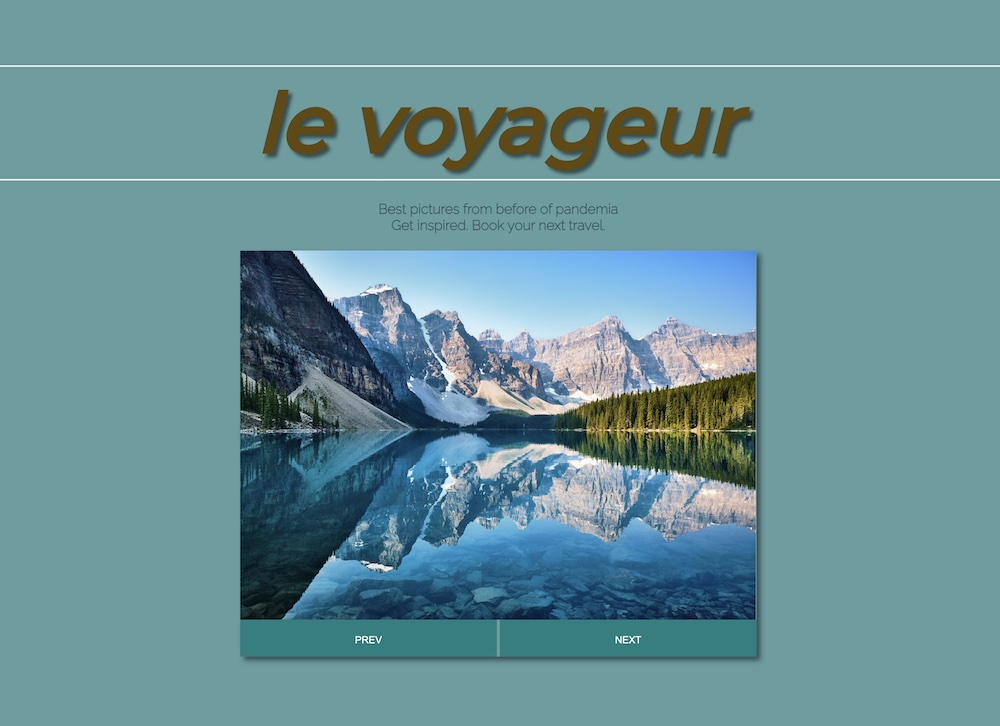

# le voyageur

This is basic JavaScript educational project.
  
"le voyageur" pretends to be a travel agency website. Form of sliding banner image / hero carousel could present current offers - suggesting (right after Covid pandemia) to get inspired basing on the slideshow.
`Perfect to be incorporated into landing page as a range of mainly promoted products / seasonal offers.`
  

   

### Future developement ideas:

- introduce booking button
- introduce transparent buttons PREV/NEXT expanded on full height of banner, dividing it on left and right halves.
    

### Credits:

- inspiration based on Brad Traversy's [tutorial](https://github.com/bradtraversy/50projects50days/tree/master/image-carousel)
- Pictures credits are inserted into html as their alternative desciption.

 
brulionman 05/21 (+04/25) 
